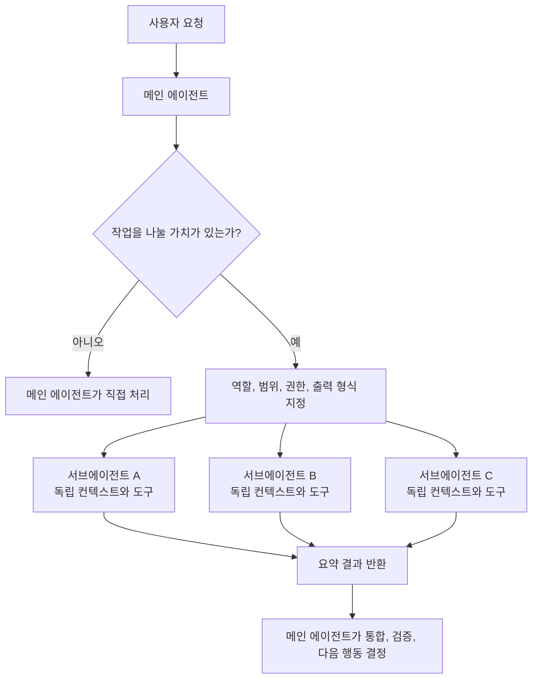

# LLM 서브에이전트는 멀티스레드인가? Codex, Claude, Gemini 비교

작성일: 2026-06-14  
범위: OpenAI Codex, Anthropic Claude Code, Google Gemini CLI의 공개 문서 기준

## 한 줄 요약

서브에이전트는 운영체제의 멀티프로세스나 멀티스레드 그 자체라기보다, 메인 에이전트가 별도의 모델 대화, 컨텍스트, 도구 권한, 작업 상태를 가진 작업자 에이전트를 띄워 일을 나누고 결과만 다시 합치는 오케스트레이션 패턴에 가깝다.

비유하면 멀티스레드의 "동시에 여러 일을 진행한다"는 감각은 닮았지만, 공유 메모리와 락을 다루는 스레드 모델과는 다르다. 실제 충돌은 메모리 레이스보다 파일 수정, 터미널 명령, 브라우저 세션, 테스트 환경, 권한 승인 같은 외부 부작용에서 주로 생긴다.

## 왜 생겼나

LLM 코딩 세션은 긴 로그, 검색 결과, 파일 덤프, 실패한 테스트 출력이 쌓일수록 메인 대화의 초점이 흐려진다. Codex 문서는 이를 context pollution, context rot으로 설명하고, 서브에이전트를 통해 탐색, 테스트, 로그 분석 같은 시끄러운 작업을 메인 스레드 밖으로 옮긴다고 설명한다.

핵심 이점은 세 가지다.

- 메인 에이전트는 요구사항, 의사결정, 최종 통합에 집중한다.
- 서브에이전트는 독립 컨텍스트에서 검색, 분석, 실행을 많이 해도 메인 대화를 덜 오염시킨다.
- 서로 독립적인 작업은 병렬로 진행해 총 시간을 줄일 수 있다.

## 멀티프로세스나 멀티스레드와의 차이

| 관점        | 멀티프로세스/멀티스레드                           | LLM 서브에이전트                                                                   |
| ----------- | ------------------------------------------------- | ---------------------------------------------------------------------------------- |
| 실행 단위   | OS 프로세스 또는 스레드                           | 별도 에이전트 세션 또는 에이전트 루프                                              |
| 상태 공유   | 메모리, 파일 디스크립터, IPC 등                   | 보통 대화 컨텍스트는 분리되고 결과 요약만 부모에게 반환                            |
| 충돌 지점   | shared memory race, deadlock, resource contention | 같은 파일 수정, 같은 포트/DB/브라우저 사용, 승인 요청, 서로 다른 설계 판단         |
| 조정 방식   | 락, 세마포어, 큐, 트랜잭션                        | 메인 에이전트의 작업 분해, 권한 제한, write scope 분리, worktree/브랜치, 최종 통합 |
| 결과 합치기 | 코드가 직접 join/reduce 구현                      | 부모 에이전트가 서브에이전트 결과를 요약, 비교, 통합                               |

따라서 "서브에이전트는 멀티스레드인가?"라는 질문에는 이렇게 답하는 편이 정확하다.

> 사용자 관점에서는 병렬 작업자처럼 보이지만, 프로그래밍 언어의 스레드가 아니라 여러 독립 LLM 세션을 오케스트레이션하는 모델이다.

## 공통 실행 흐름



일반적인 처리 순서는 다음과 같다.

1. 메인 에이전트가 사용자의 목표를 해석한다.
2. 병렬화 가능한 작업과 직접 처리해야 할 작업을 나눈다.
3. 각 서브에이전트에 역할, 입력, 금지사항, 도구 권한, 출력 형식을 준다.
4. 서브에이전트는 자기 컨텍스트에서 파일 읽기, 검색, 명령 실행, 코드 수정 등을 수행한다.
5. 서브에이전트는 원본 로그 전체가 아니라 요약, 근거, 변경 사항, 실패 원인을 반환한다.
6. 메인 에이전트가 결과를 비교하고 최종 결정을 내린다.

이 흐름에서 중요한 점은 "서브에이전트가 스스로 알아서 전체 프로젝트를 완성한다"가 아니라 "메인 에이전트가 작은 임무를 맡기고 결과를 회수한다"에 가깝다는 것이다.

## 제품별 관리 방식

| 제품        | 호출 방식             | 정의 방식                   | 충돌 관리 키워드                         |
| ----------- | --------------------- | --------------------------- | ---------------------------------------- |
| Codex       | 명시 요청 중심        | TOML agent file             | sandbox, approval, thread cap            |
| Claude Code | 자동 위임 + 명시 호출 | Markdown + YAML frontmatter | tools, permissionMode, worktree          |
| Gemini CLI  | 자동 위임 + `@agent`  | Markdown + YAML frontmatter | tool isolation, policy, no nested agents |

### Codex

Codex는 서브에이전트 워크플로를 "전문 에이전트를 병렬로 spawn해서 탐색, 처리, 분석을 동시에 수행하고 결과를 합치는 방식"으로 설명한다. 현재 Codex의 공개 문서 기준으로는 사용자가 명시적으로 서브에이전트나 병렬 작업을 요청할 때만 새 에이전트를 띄운다. 자세한 동작과 설정은 OpenAI의 [Codex Subagents 문서](https://developers.openai.com/codex/subagents)와 [개념 문서](https://developers.openai.com/codex/concepts/subagents)에 정리되어 있다.

관리 관점에서 볼 만한 포인트는 다음과 같다.

- 내장 에이전트로 `default`, `worker`, `explorer`가 있다.
- 커스텀 에이전트는 개인 범위 `~/.codex/agents/` 또는 프로젝트 범위 `.codex/agents/`에 독립 TOML 파일로 정의한다.
- 전역 설정은 `[agents]` 아래에서 관리하며, 예를 들어 `max_threads`로 동시에 열 수 있는 agent thread 수를 제한하고 `max_depth`로 중첩 spawn 깊이를 제한한다.
- 서브에이전트는 부모 세션의 sandbox policy와 approval policy를 상속한다. 대화 중 바꾼 `/permissions` 같은 런타임 설정도 자식에게 다시 적용된다.
- CLI에서는 `/agent`로 활성 agent thread를 전환하거나 확인할 수 있다.

Codex를 쓸 때 좋은 패턴은 "보안 리뷰 1명, 테스트 공백 리뷰 1명, 유지보수성 리뷰 1명"처럼 서로 독립적인 읽기 중심 작업을 나누는 것이다. 반대로 여러 `worker`가 같은 파일을 동시에 고치게 하면 통합 비용이 빠르게 커진다.

### Claude Code

Claude Code의 subagent는 "특정 종류의 작업을 처리하는 전문 AI assistant"로 설명된다. 각 subagent는 별도 context window, custom system prompt, tool access, independent permissions를 가진다. Claude가 subagent 설명과 현재 요청을 보고 자동 위임할 수 있고, 사용자가 직접 특정 subagent를 부를 수도 있다. 이 동작은 Anthropic의 [Create custom subagents](https://code.claude.com/docs/en/sub-agents) 문서에 설명되어 있다.

Claude Code 쪽의 특징은 설정 표면이 넓다는 점이다.

- Subagent는 Markdown 파일과 YAML frontmatter로 정의한다.
- 필수 필드는 `name`, `description`이고, 선택 필드로 `tools`, `disallowedTools`, `model`, `permissionMode`, `maxTurns`, `skills`, `mcpServers`, `hooks`, `memory`, `background`, `effort`, `isolation` 등이 있다.
- 일반 subagent는 fresh context로 시작한다. 즉 메인 대화의 이전 히스토리나 이미 읽은 파일을 자동으로 모두 가져가지 않는다.
- forked subagent는 예외적으로 메인 대화 전체를 상속한다. 대신 tool call의 중간 과정은 메인 대화를 더럽히지 않고 최종 결과만 돌아온다.
- `isolation: worktree`를 설정하면 subagent가 임시 git worktree에서 실행되어 병렬 수정 충돌을 줄일 수 있다. 관련 격리 방식은 [worktrees 문서](https://code.claude.com/docs/en/worktrees)가 별도로 다룬다.
- Foreground subagent는 메인 대화를 막고 진행되며, background subagent는 동시에 실행될 수 있다. Background에서는 사용자에게 물어야 하는 일부 도구 호출이 자동 거부될 수 있다.

Claude Code는 "subagent"와 "agent teams"도 구분한다. Subagent는 메인 세션 안에서 결과를 돌려주는 작업자에 가깝고, [agent teams](https://code.claude.com/docs/en/agent-teams)는 여러 독립 Claude Code 세션이 공유 작업 목록과 상호 메시징으로 협업하는 실험적 기능에 가깝다.

### Gemini CLI

Gemini CLI도 2026년 4월 [Google Developers Blog](https://developers.googleblog.com/subagents-have-arrived-in-gemini-cli/)에서 subagents를 "메인 Gemini CLI 세션 옆에서 동작하는 전문 expert agents"로 소개했다. [Gemini CLI Subagents 문서](https://geminicli.com/docs/core/subagents/) 기준으로 각 subagent는 별도 context window, custom system instructions, curated tools를 가지며, 실행 결과는 메인 에이전트에 하나의 응답으로 합쳐진다.

Gemini CLI의 특징은 subagent가 메인 에이전트에게 "같은 이름의 도구"처럼 노출된다는 점이다.

- 자동 위임: 메인 에이전트가 작업과 subagent 설명이 맞는다고 판단하면 호출한다.
- 명시 호출: 프롬프트 앞에 `@codebase_investigator`처럼 `@` 문법을 써서 특정 subagent를 강제할 수 있다.
- 내장 subagent로 `codebase_investigator`, `cli_help`, `generalist`, `browser_agent` 등이 있다.
- 커스텀 subagent는 `.gemini/agents/*.md` 또는 `~/.gemini/agents/*.md`에 Markdown + YAML frontmatter로 둔다.
- `tools`, `mcpServers`, `model`, `max_turns`, `timeout_mins` 등으로 실행 능력을 제한한다.
- Recursion protection 때문에 subagent는 다른 subagent를 호출할 수 없다.
- `/agents` 명령과 `settings.json`의 `agents.overrides`로 활성화, 비활성화, 실행 제한을 관리할 수 있다.
- `kind: remote` 정의와 Agent-to-Agent(A2A) 프로토콜로 [원격 subagent](https://geminicli.com/docs/core/remote-agents/)에도 위임할 수 있다.

Google의 공식 블로그는 병렬 subagent가 여러 조사나 분리된 리팩터링을 빠르게 할 수 있다고 설명하면서도, 여러 agent가 동시에 코드를 수정하면 충돌이나 덮어쓰기 위험이 있으며 사용량 제한도 더 빨리 소모될 수 있다고 경고한다.

헷갈리기 쉬운 인접 기능도 있다. Gemini CLI의 Agent Skills는 필요할 때 로드되는 지식과 리소스 묶음이고, custom commands는 재사용 가능한 프롬프트 단축키다. 둘 다 subagent처럼 별도 작업자 루프를 띄우는 개념과는 구분된다.

## 내부 구현을 이해하는 실용적 모델

공개 문서만 놓고 보면 세 제품의 실제 내부 서버 구현까지 단정할 수는 없다. 다만 사용자가 관찰하고 설계에 활용할 수 있는 추상화는 꽤 비슷하다.

```text
Subagent =
  Agent definition
  + system/developer instructions
  + model and reasoning settings
  + tool registry or allowlist
  + permission/sandbox policy
  + isolated conversation history
  + execution transcript
  + result channel back to parent
```

이 관점에서 보면 충돌 방지는 "LLM이 더 똑똑하면 해결된다"가 아니라 "작업 정의와 도구 권한을 어떻게 제한하느냐"의 문제다.

- 컨텍스트 격리: 중간 로그와 파일 덤프가 메인 대화에 쌓이지 않게 한다.
- 도구 격리: 읽기 전용 agent, 브라우저 전용 agent, 문서 조사 agent처럼 가능한 행동을 제한한다.
- 파일 격리: worktree, branch, forked checkout으로 같은 파일을 동시에 쓰지 않게 한다.
- 결과 격리: 원본 출력 전체가 아니라 근거와 요약만 부모에게 반환한다.
- 통합 책임: 최종 판단, 충돌 해결, 테스트 실행은 부모 또는 사람이 한다.

## 충돌은 어디서 생기나

서브에이전트 충돌은 크게 다섯 가지로 나눌 수 있다.

### 1. 파일 충돌

두 agent가 같은 파일을 동시에 수정하면 나중 결과가 앞선 결과를 덮거나, patch 적용이 실패하거나, 논리적으로 서로 맞지 않는 코드가 남을 수 있다.

예방책:

- 한 agent는 한 디렉터리나 한 모듈만 맡긴다.
- 같은 파일을 건드릴 가능성이 있으면 병렬로 쓰게 하지 않는다.
- 병렬 agent는 먼저 read-only 조사만 시키고, 실제 수정은 한 worker에게 맡긴다.
- 가능한 경우 git worktree나 별도 branch를 사용한다.

### 2. 의미 충돌

서로 다른 파일을 고쳤어도 설계 결정이 충돌할 수 있다. 예를 들어 한 agent는 API 응답 필드를 바꾸고, 다른 agent는 기존 응답 스키마를 전제로 UI를 수정할 수 있다.

예방책:

- 공통 인터페이스, 타입, API 계약은 먼저 정한다.
- agent별 출력에 "내가 가정한 계약"을 포함하게 한다.
- 부모 에이전트가 통합 전에 가정 충돌을 점검한다.

### 3. 환경 충돌

같은 포트의 dev server, 같은 테스트 DB, 같은 브라우저 프로필, 같은 임시 파일을 여러 agent가 동시에 쓰면 실패가 재현되지 않거나 서로의 상태를 오염시킨다.

예방책:

- agent별 포트, 임시 디렉터리, 테스트 DB를 분리한다.
- 브라우저 agent는 isolated profile을 쓰게 한다.
- 상태를 바꾸는 명령은 병렬로 실행하지 않는다.

### 4. 권한 충돌

서브에이전트가 승인 필요한 명령을 실행했는데 사용자가 다른 thread를 보고 있거나, background 실행이라 prompt를 띄울 수 없으면 작업이 실패할 수 있다. Codex와 Claude 모두 부모 세션의 권한 모드가 subagent에 영향을 주는 구조를 갖는다.

예방책:

- 조사 agent는 읽기 전용 권한으로 제한한다.
- 쓰기 agent는 필요한 권한만 갖게 한다.
- 승인 필요한 작업은 foreground 또는 메인 에이전트가 수행한다.

### 5. 컨텍스트 충돌

서브에이전트는 독립 컨텍스트에서 움직이므로 메인 대화의 최신 결정을 모를 수 있다. 반대로 fork처럼 전체 대화를 상속하면 편하지만, 오래된 정보와 잡음까지 따라갈 수 있다.

예방책:

- 위임 프롬프트에 최신 결정, 금지사항, 출력 형식을 명확히 넣는다.
- 긴 작업에서는 중간에 결과를 받아 부모가 방향을 재조정한다.
- 결과 요약에는 근거 파일, 명령, 가정을 포함하게 한다.

## 좋은 위임 프롬프트의 형태

나쁜 예:

```text
서브에이전트들로 알아서 고쳐줘.
```

좋은 예:

```text
서브에이전트 3개를 병렬로 사용해줘.
1. explorer: 인증 흐름을 읽기 전용으로 추적하고 관련 파일만 보고해줘.
2. tester: 현재 실패하는 테스트와 재현 명령을 찾아줘. 파일 수정은 하지 마.
3. worker: explorer와 tester 결과가 나온 뒤 auth/session 모듈만 수정해줘.

각 agent는 자신이 읽은 파일, 실행한 명령, 가정, 남은 위험을 요약해줘.
같은 파일을 동시에 수정하지 말고, 최종 통합은 메인 에이전트가 해줘.
```

핵심은 agent 수가 아니라 경계다. 누가 읽기만 하는지, 누가 쓰는지, 어떤 파일을 소유하는지, 결과를 언제 합칠지 정해야 한다.

## 세 제품을 한 문장으로 비교하면

- Codex: 명시적으로 병렬 agent workflow를 요청하면, 부모가 agent thread들을 만들고 결과를 기다려 통합하는 방식에 초점이 있다.
- Claude Code: subagent 설정, 권한, hooks, background, fork, worktree 등 세밀한 운영 옵션이 강하다.
- Gemini CLI: subagent를 메인 agent가 호출하는 도구처럼 노출하고, `@agent` 문법과 내장 expert agent로 CLI 안에서 빠르게 위임하는 흐름이 강하다.

## 실무 기준 체크리스트

- 독립적인 read-heavy 작업부터 병렬화한다.
- write-heavy 작업은 하나의 agent가 한 영역을 소유하게 한다.
- 같은 파일을 여러 agent가 수정하게 하지 않는다.
- 권한은 기본적으로 최소화한다.
- 작업 결과에는 근거, 가정, 변경 파일, 검증 명령을 포함시킨다.
- 최종 통합자는 항상 한 명으로 둔다.
- 병렬 실행이 비용과 토큰을 더 쓴다는 점을 감안한다.
- 공개 문서에 없는 내부 구현은 "추정"으로만 말한다.

## 출처

- OpenAI Developers, [Subagents - Codex](https://developers.openai.com/codex/subagents)
- OpenAI Developers, [Subagents concept - Codex](https://developers.openai.com/codex/concepts/subagents)
- OpenAI Developers, [Codex CLI features](https://developers.openai.com/codex/cli/features)
- Anthropic Claude Code Docs, [Create custom subagents](https://code.claude.com/docs/en/sub-agents)
- Anthropic Claude Code Docs, [Run parallel sessions with worktrees](https://code.claude.com/docs/en/worktrees)
- Anthropic Claude Code Docs, [Orchestrate teams of Claude Code sessions](https://code.claude.com/docs/en/agent-teams)
- Google Developers Blog, [Subagents have arrived in Gemini CLI](https://developers.googleblog.com/subagents-have-arrived-in-gemini-cli/)
- Gemini CLI Docs, [Subagents](https://geminicli.com/docs/core/subagents/)
- Gemini CLI Docs, [Remote Subagents](https://geminicli.com/docs/core/remote-agents/)
- Google for Developers, [Gemini CLI](https://developers.google.com/gemini-code-assist/docs/gemini-cli)
