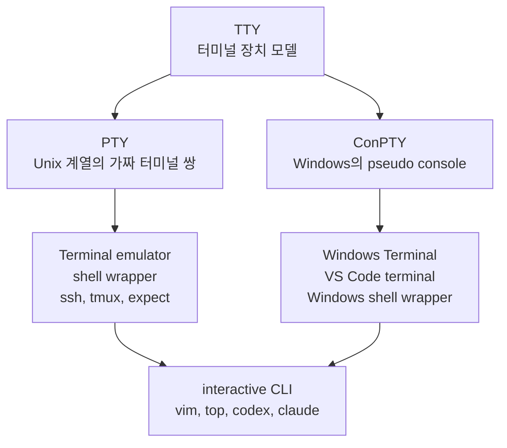
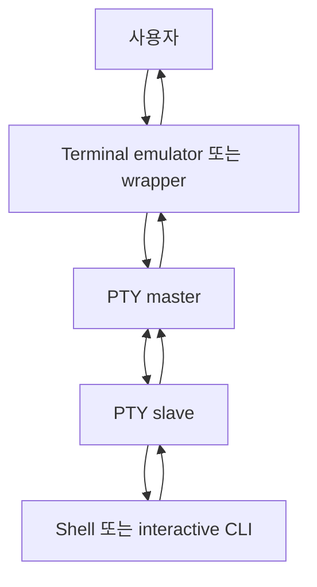
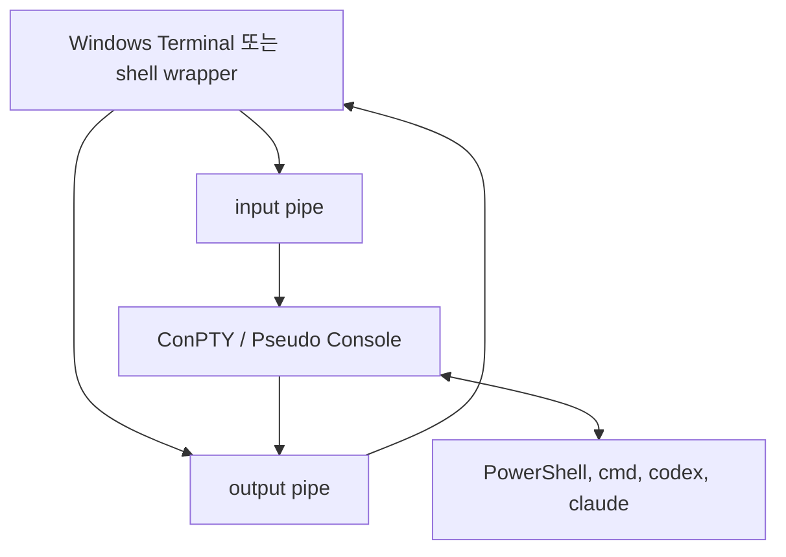
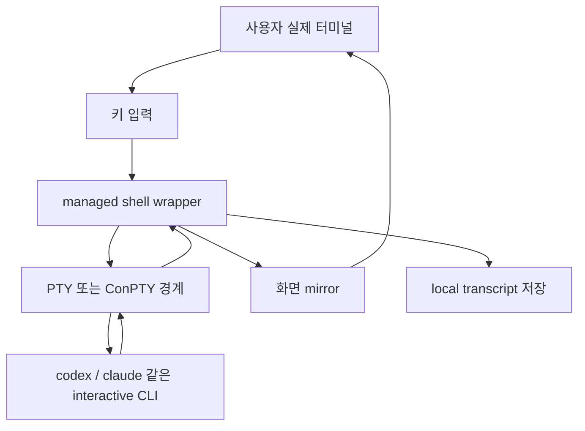
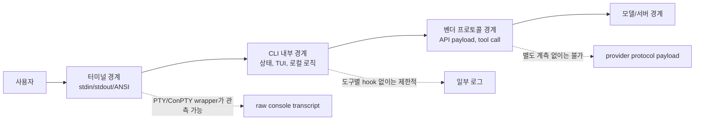

# TTY, PTY, ConPTY: 터미널 경계에서 입출력을 붙잡는 법

작성일: 2026-07-06  
범위: TTY, PTY, ConPTY, pipe, terminal emulator, shell wrapper, terminal-boundary capture

## 한 줄 요약

TTY는 원래 물리 터미널에서 출발한 운영체제의 터미널 장치 모델이고, PTY와 ConPTY는 현대 소프트웨어가 그 터미널 환경을 가짜로 만들어 CLI 프로그램에게 제공하는 방법이다. shell wrapper는 이 PTY/ConPTY 경계 위에 올라가서 사용자의 입력과 프로그램의 출력을 중계하고, 동시에 그 내용을 기록한다.

중요한 점은 이것이 벤더 내부 프로토콜을 들여다보는 방식이 아니라는 것이다. Codex나 Claude가 내부적으로 어떤 API payload를 주고받는지를 보는 것이 아니라, 사용자가 터미널에 입력했고 CLI가 터미널에 출력한 "터미널 경계 원문"을 붙잡는 방식이다.

## 왜 이 개념이 필요한가

CLI 프로그램을 자동화하거나 기록하려고 하면 처음에는 단순히 표준 입력과 표준 출력을 pipe로 감싸면 될 것처럼 보인다.

```bash
some-command > output.txt
echo "hello" | some-command
```

이 방식은 한 번 실행하고 결과 텍스트를 받는 프로그램에는 충분할 수 있다. 하지만 `vim`, `top`, `ssh`, `tmux`, `codex`, `claude` 같은 프로그램은 단순히 한 줄 입력을 받고 한 줄 출력을 내는 프로그램이 아니다. 이들은 현재 자신이 진짜 터미널 안에서 실행 중인지 확인하고, 그 결과에 따라 색상, 커서 이동, 전체 화면 UI, 키 입력 처리, `Ctrl+C` 처리 방식을 바꾼다.

그래서 단순 pipe로 감싸면 출력은 잡힐 수 있어도 프로그램의 동작 모드가 바뀌거나 TUI가 깨질 수 있다. 이 문제를 풀기 위해 필요한 개념이 TTY, PTY, ConPTY다.

## 전체 지도

세 개념은 같은 층위의 단어가 아니다.



TTY는 "터미널이라는 장치가 어떤 방식으로 사용자 입력과 프로그램 출력을 다루는가"에 대한 모델이다. PTY와 ConPTY는 그 모델을 현대 운영체제 안에서 소프트웨어적으로 재현하는 장치 또는 API다. shell wrapper는 그 위에 올라가서 실제 CLI 실행을 감싸고 관측한다.

## TTY: 터미널이라는 장치 모델

TTY는 teletype에서 온 말이다. 초기 컴퓨터 환경에서 사용자는 컴퓨터 본체 앞의 그래픽 화면을 쓰는 것이 아니라, 키보드와 출력 장치가 달린 물리 단말기를 통해 중앙 컴퓨터에 접속했다. 이 단말기가 terminal이고, 그 대표적인 형태가 teletype이었다.

Unix 계열 운영체제는 이런 터미널을 장치처럼 다뤘다. 그래서 `/dev/tty` 같은 장치 파일이 있고, 프로그램은 사용자의 입력을 `stdin`에서 읽고, 출력을 `stdout`이나 `stderr`에 쓴다.

```bash
tty
stty -a
```

`tty` 명령은 현재 표준 입력에 연결된 터미널 장치 이름을 보여준다. `stty -a`는 현재 터미널의 모드와 제어 문자를 보여준다. 여기서 보이는 값들은 터미널이 단순한 화면이 아니라 입력 규칙과 신호 규칙을 가진 장치라는 점을 보여준다.

TTY가 담당하는 대표적인 동작은 다음과 같다.

- 입력한 문자를 화면에 다시 보여주는 echo
- Enter를 누르기 전까지 입력을 모으는 canonical mode
- 한 글자씩 바로 넘기는 raw mode
- `Ctrl+C`를 foreground process group에 대한 interrupt signal로 바꾸는 처리
- `Ctrl+D`를 EOF처럼 해석하는 처리
- 현재 세션의 controlling terminal 역할

즉 TTY는 "문자를 보여주는 창"이 아니라, 프로세스와 사용자 사이의 입출력 규칙을 담은 장치 모델이다.

## 터미널, 셸, CLI 프로그램은 다르다

일상적으로는 "터미널에서 명령을 친다"고 말하지만, 실제로는 여러 층이 함께 움직인다.

| 층                | 예시                                                   | 역할                                                    |
| ----------------- | ------------------------------------------------------ | ------------------------------------------------------- |
| 터미널 에뮬레이터 | Terminal.app, iTerm2, GNOME Terminal, Windows Terminal | 사용자의 키 입력을 받고 화면을 그린다.                  |
| 셸                | bash, zsh, fish, PowerShell, cmd.exe                   | 명령어를 해석하고 프로그램을 실행한다.                  |
| CLI 프로그램      | git, npm, python, ssh, vim, codex, claude              | 실제 작업을 수행한다.                                   |
| 터미널 장치 모델  | TTY, PTY, ConPTY                                       | 위 층들이 터미널처럼 연결되도록 입출력 경계를 제공한다. |

터미널 에뮬레이터는 창이고, 셸은 명령 해석기이며, CLI 프로그램은 실제 일을 하는 도구다. TTY/PTY/ConPTY는 이들이 서로 "터미널 안에서 실행 중"이라는 공통 약속을 공유하도록 만든다.

## PTY: 가짜 터미널을 만들어주는 장치 쌍

현대에는 대부분 물리 TTY를 쓰지 않는다. 우리는 터미널 에뮬레이터나 IDE 내장 터미널을 쓴다. 그런데 shell이나 CLI 프로그램 입장에서는 여전히 "나는 터미널 안에서 실행 중이다"라는 환경이 필요하다.

이때 쓰이는 것이 PTY, pseudo terminal이다.

PTY는 보통 master/slave 쌍으로 설명한다.



터미널 에뮬레이터나 wrapper는 master 쪽을 잡고, shell이나 CLI 프로그램은 slave 쪽을 진짜 TTY처럼 본다. 프로그램은 slave 쪽을 통해 입력을 받고 출력을 내보내며, 자신이 interactive terminal 안에서 실행 중이라고 판단한다.

이 구조 덕분에 실제 하드웨어 터미널이 없어도 `ssh`, `tmux`, `screen`, `expect`, `vim`, `top` 같은 프로그램이 자연스럽게 동작한다. 프로그램이 보기에는 slave 쪽이 고전적인 터미널처럼 보이고, 바깥의 터미널 에뮬레이터나 wrapper는 master 쪽에서 오가는 문자를 읽고 쓴다.

## pipe와 PTY는 왜 다른가

pipe는 단순한 byte stream이다. 한 프로그램의 출력을 다른 프로그램의 입력으로 넘기기에 좋다.

```bash
ls | grep html
```

하지만 pipe는 터미널 장치가 아니다. 프로그램은 보통 `isatty()` 같은 방식으로 자신의 `stdin`이나 `stdout`이 터미널인지 확인한다. 터미널이면 색상을 켜고, progress bar를 그리고, raw key 입력을 받는다. 터미널이 아니면 로그나 파일에 쓰기 좋은 단순한 출력으로 바꾼다.

그래서 다음 두 실행은 같은 명령처럼 보여도 다르게 동작할 수 있다.

```bash
ls
ls | cat
```

첫 번째는 터미널에 직접 출력하므로 색상이 나올 수 있다. 두 번째는 pipe로 연결되므로 색상이 꺼질 수 있다. 더 복잡한 TUI 프로그램은 pipe 환경에서 아예 제대로 동작하지 않을 수도 있다.

| 관점            | pipe                 | PTY                                   |
| --------------- | -------------------- | ------------------------------------- |
| 정체            | byte stream          | 터미널처럼 보이는 장치 쌍             |
| `isatty()`      | 보통 false           | 보통 true                             |
| 색상 출력       | 꺼질 수 있음         | 유지되기 쉬움                         |
| full-screen TUI | 부적합               | 적합                                  |
| raw key input   | 다루기 어려움        | 터미널 모드로 처리 가능               |
| 대표 사용       | 로그 저장, 명령 조합 | 터미널 에뮬레이터, ssh, tmux, wrapper |

정리하면 pipe는 "출력을 전달하는 통로"이고, PTY는 "프로그램에게 터미널 환경을 제공하는 장치"다.

## 터미널 UI는 문자만 출력하지 않는다

터미널 프로그램은 화면에 글자를 한 줄씩 출력하기만 하는 것이 아니다. 커서를 옮기고, 색상을 바꾸고, 화면 일부를 지우고, alternate screen으로 들어가고, 사용자의 키 입력을 제어 문자로 받는다.

이때 많이 쓰이는 것이 ANSI/VT 계열 escape sequence다.

```text
ESC [ 31 m       빨간색 시작
ESC [ 0 m        스타일 초기화
ESC [ 2 J        화면 지우기
ESC [ ?1049 h    alternate screen 진입
ESC [ ?1049 l    alternate screen 종료
```

사람에게는 색상과 레이아웃으로 보이지만, 터미널 경계에서는 이런 제어 시퀀스가 섞인 문자 stream이다. 그래서 TUI를 기록하려면 단순히 "최종 화면 텍스트"만 저장하는 것으로는 부족하다. 어떤 순서로 어떤 제어 문자가 오갔는지까지 보존해야 나중에 화면 변화와 깨짐을 분석할 수 있다.

## ConPTY: Windows의 pseudo console

Windows는 전통적으로 Unix의 TTY/PTY와 다른 console 모델을 사용했다. Windows console application은 Win32 Console API와 console host를 중심으로 동작했다. 이 구조는 Windows 내부에서는 자연스러웠지만, Unix식 터미널 생태계와 연결하기에는 불편한 부분이 있었다.

Windows Terminal, VS Code terminal, OpenSSH, WSL, cross-platform CLI 도구가 중요해지면서 Windows에도 "프로그램을 터미널처럼 실행시키고 그 입출력을 중간에서 다룰 수 있는 표준 경계"가 필요해졌다. 그 역할을 하는 것이 ConPTY다.

ConPTY는 Windows Pseudo Console API다. Unix PTY와 완전히 같은 것은 아니지만 목적은 비슷하다.



Microsoft 문서의 표현을 빌리면, pseudoconsole session은 character-mode application의 활동을 host할 수 있게 해준다. 전통적인 console session에서는 운영체제가 console host를 자동으로 붙이지만, pseudoconsole session에서는 hosting application이 통신 채널을 먼저 만들고 그 안에서 child character-mode application을 실행한다.

즉 ConPTY는 Windows에서 CLI 프로그램을 pseudo console 안에 실행시키고, 바깥의 터미널 앱이나 wrapper가 그 입출력을 중계할 수 있게 해준다.

## shell wrapper는 왜 PTY/ConPTY 위에 올라가야 하나

PTY나 ConPTY는 터미널 같은 실행 환경을 제공한다. 하지만 그것만으로 기록이나 검증이 자동으로 생기지는 않는다. 누군가가 그 경계를 만들고, 그 안에서 CLI를 실행하고, 사용자의 입력을 전달하고, 프로그램의 출력을 다시 사용자 화면에 보여주고, 동시에 transcript를 저장해야 한다.

그 역할이 shell wrapper다.



여기서 wrapper가 중요한 이유는 세 가지다.

첫째, CLI가 기대하는 interactive terminal 환경을 유지한다. 단순 pipe로 감싸면 Codex나 Claude 같은 TUI 기반 CLI가 다른 모드로 동작하거나 화면이 깨질 수 있다.

둘째, 사용자가 실제로 본 입출력을 기록할 수 있다. 모델 응답을 나중에 요약하는 것이 아니라, 터미널 경계에서 오간 `stdin`/`stdout` 원문을 증거로 남길 수 있다.

셋째, 특정 벤더 내부 구현에 덜 묶인다. Codex 전용 API hook, Claude 전용 내부 protocol hook을 만드는 대신, CLI가 공통으로 통과하는 터미널 경계를 관측한다. 그래서 같은 구조를 여러 terminal-based AI 도구에 적용할 수 있다.

## 무엇을 볼 수 있고 무엇을 볼 수 없는가

PTY/ConPTY 기반 shell wrapper가 볼 수 있는 것은 터미널에 오간 내용이다.

볼 수 있는 것:

- 사용자가 터미널에 입력한 prompt
- CLI가 화면에 출력한 텍스트
- ANSI/VT escape sequence
- full-screen TUI 출력
- 일부 키 입력과 제어 문자
- 실행 중 화면이 어떻게 바뀌었는지에 대한 raw transcript

반대로 이것만으로는 볼 수 없는 것도 있다.

볼 수 없는 것:

- 벤더 내부 API request/response payload
- 모델 provider 내부 tool call protocol
- CLI 내부 메모리 상태
- 서버 쪽 reasoning trace
- 터미널에 출력되지 않은 내부 이벤트

따라서 이 구조를 설명할 때는 "prompt 원문을 잡는다"는 말을 조심해야 한다. 더 정확한 표현은 "터미널 경계에서 사용자가 입력한 prompt 원문을 잡는다"이다. 이것은 vendor 내부 protocol payload와 다르다.

## 관측 경계를 나눠서 보기

터미널 기반 AI CLI를 관측할 때는 최소 세 경계를 구분해야 한다.



우리의 shell wrapper가 잡는 것은 첫 번째 경계다. 이 경계는 사용자가 실제로 본 것과 입력한 것을 보존한다는 점에서 강하다. 대신 내부 protocol payload를 직접 증명하지는 않는다. 이 구분을 분명히 해야 수집한 증거의 의미를 과장하지 않고, 동시에 그 증거가 왜 유용한지도 정확히 말할 수 있다.

## 실무 체크리스트

TTY/PTY/ConPTY 관련 문제를 만났을 때는 다음 질문을 순서대로 보면 좋다.

1. 이 프로그램은 `stdin`이나 `stdout`이 TTY인지 확인하는가?
2. pipe로 실행했을 때 색상, progress bar, TUI, prompt 방식이 바뀌는가?
3. raw mode, canonical mode, echo 설정이 필요한가?
4. `Ctrl+C`, `Ctrl+D`, resize, alternate screen 처리가 필요한가?
5. Unix 계열이면 PTY master/slave 경계가 있는가?
6. Windows이면 ConPTY를 통해 child console application을 host하고 있는가?
7. 기록하려는 것이 터미널 경계 원문인가, 도구 내부 로그인가, 벤더 protocol payload인가?

이 질문에 답하면 "그냥 stdout을 저장하면 되는 문제"인지, "PTY/ConPTY를 가진 shell wrapper가 필요한 문제"인지가 비교적 분명해진다.

## 결론

TTY는 터미널이라는 오래된 장치 모델이고, PTY와 ConPTY는 그 모델을 현대 소프트웨어 안에서 재현하는 방법이다. 단순 pipe는 출력 텍스트를 옮길 수는 있지만, 프로그램에게 "진짜 터미널 안에서 실행 중"이라는 환경을 제공하지는 못한다.

그래서 Codex나 Claude 같은 interactive CLI를 기록하고 검증하려면 PTY/ConPTY 경계가 필요하다. 그리고 그 경계를 실제 사용자 세션에 끼워 넣어 실행, 중계, 기록을 담당하는 계층이 shell wrapper다.

이 구조의 핵심은 내부를 몰래 들여다보는 것이 아니라, 사용자가 실제로 터미널에서 주고받은 것을 보존하는 데 있다.

## 출처

- The Open Group, [General Terminal Interface](https://pubs.opengroup.org/onlinepubs/9699919799/basedefs/V1_chap11.html)
- Linux man-pages, [pty(7) - pseudoterminal interfaces](https://man7.org/linux/man-pages/man7/pty.7.html)
- Linux man-pages, [termios(3)](https://man7.org/linux/man-pages/man3/termios.3.html)
- Linux man-pages, [pts(4)](https://man7.org/linux/man-pages/man4/pts.4.html)
- Microsoft Learn, [Pseudoconsoles](https://learn.microsoft.com/en-us/windows/console/pseudoconsoles)
- Microsoft Learn, [Creating a Pseudoconsole session](https://learn.microsoft.com/en-us/windows/console/creating-a-pseudoconsole-session)
- Microsoft Learn, [Console Virtual Terminal Sequences](https://learn.microsoft.com/en-us/windows/console/console-virtual-terminal-sequences)
- Microsoft DevBlogs, [Introducing the Windows Pseudo Console (ConPTY)](https://devblogs.microsoft.com/commandline/windows-command-line-introducing-the-windows-pseudo-console-conpty/)
